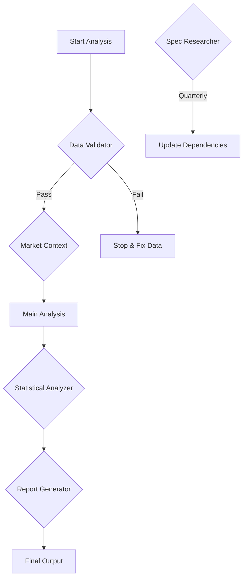

# Subagents for Hypothesis Verification

Subagents are specialized AI agents designed to handle specific aspects of the hypothesis verification process. Each subagent has deep expertise in its domain and can be triggered automatically or manually.

## 🤖 Available Subagents

### 1. Data Validator (`data_validator.md`)
**Purpose**: Ensures data quality and completeness before analysis

**Key Features**:
- Validates data completeness
- Checks for duplicates and anomalies
- Verifies API data freshness
- Cross-references social media with market data

**When to Use**: Before any analysis, when data sources change

### 2. Market Context Researcher (`market_context.md`)
**Purpose**: Provides comprehensive market context to identify external factors

**Key Features**:
- Researches market events during analysis period
- Identifies company-specific catalysts
- Tracks macro economic factors
- Monitors social media trends

**When to Use**: Before analyzing stock price impacts

### 3. Statistical Analyzer (`statistical_analyzer.md`)
**Purpose**: Performs rigorous statistical validation of findings

**Key Features**:
- Correlation analysis (Pearson, Spearman, partial)
- Statistical significance testing
- Regression modeling
- Robustness checks

**When to Use**: After initial analysis, for publication-ready reports

### 4. Report Generator (`report_generator.md`)
**Purpose**: Creates professional, standardized reports

**Key Features**:
- Multiple output formats (MD, PDF, HTML, LaTeX)
- Standardized visualizations
- Executive summaries
- Technical appendices

**When to Use**: After analysis completion

### 5. Spec Researcher (`spec_researcher.md`)
**Purpose**: Keeps technical stack up-to-date with latest best practices

**Key Features**:
- API version monitoring
- Security vulnerability tracking
- Best practices research
- Alternative solution evaluation

**When to Use**: Before updates, quarterly reviews

## 🚀 Using Subagents

### With the Framework

```python
from src.core.subagent_framework import setup_subagents

# Initialize orchestrator
orchestrator = setup_subagents()

# Execute relevant subagents
context = {"stage": "pre_analysis"}
input_data = {"posts": [...], "market_data": {...}}

results = orchestrator.execute_relevant_subagents(context, input_data)
```

### Manual Triggering

Subagents can also be used as reference guides for manual analysis:

1. Read the subagent specification
2. Follow the methodology outlined
3. Use the output format as a template
4. Document findings accordingly

## 📋 Creating New Subagents

To create a new subagent:

1. **Define the specification** in `subagents/{name}.md`:
   ```markdown
   # [Name] Subagent
   
   ## Purpose
   [Clear purpose statement]
   
   ## Trigger Conditions
   [When should this activate?]
   
   ## Responsibilities
   [What it does]
   
   ## Output Format
   [Expected output structure]
   ```

2. **Implement in Python** (optional):
   ```python
   class YourSubagent(SubagentBase):
       def should_trigger(self, context):
           # Define trigger logic
           
       def execute(self, input_data):
           # Implement functionality
   ```

3. **Register with orchestrator**:
   ```python
   orchestrator.register_subagent(YourSubagent("your_subagent"))
   ```

## 🎯 Best Practices

1. **Single Responsibility**: Each subagent should focus on one specific task
2. **Clear Triggers**: Define explicit conditions for activation
3. **Structured Output**: Use consistent JSON output formats
4. **Error Handling**: Gracefully handle failures
5. **Logging**: Provide detailed logs for debugging
6. **Documentation**: Keep specifications up-to-date

## 🔄 Subagent Workflow



## 💡 Benefits

1. **Specialization**: Each subagent is an expert in its domain
2. **Modularity**: Easy to add, remove, or update subagents
3. **Quality Control**: Automated validation and verification
4. **Consistency**: Standardized outputs and processes
5. **Efficiency**: Parallel execution of independent subagents

## 🔗 Integration with Main System

Subagents integrate seamlessly with the hypothesis verification system:

```yaml
# In your experiment template
experiment:
  subagents:
    - data_validator
    - market_context
    - statistical_analyzer
    - report_generator
```

The system will automatically trigger appropriate subagents at the right stages of analysis.