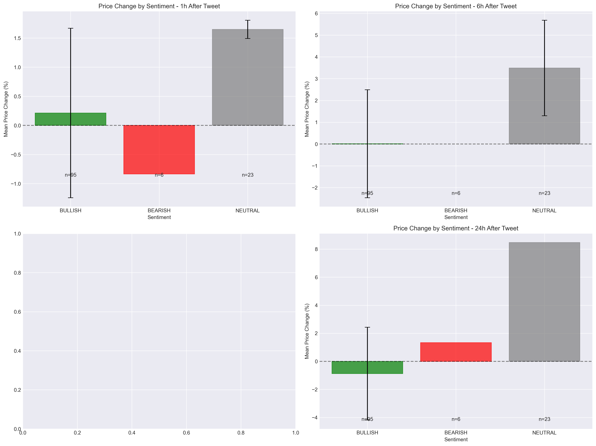
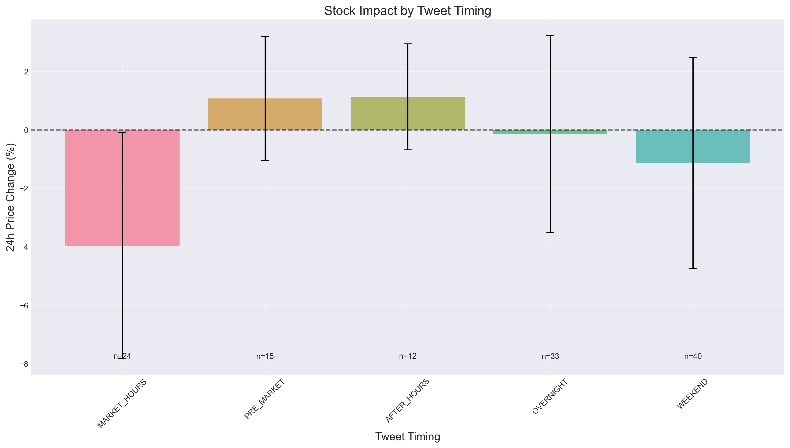
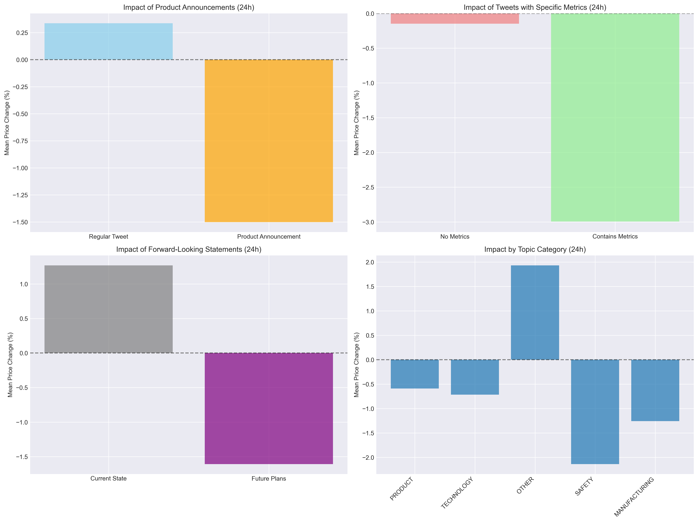
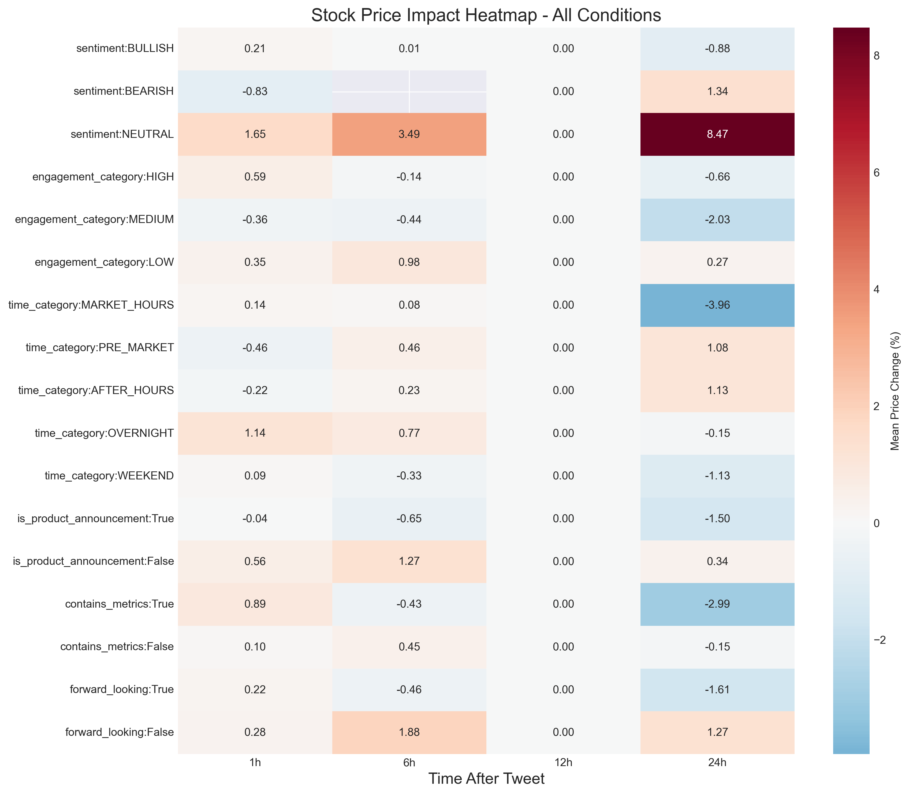

# Comprehensive Tesla Stock Impact Analysis - Multiple Conditions

**Analysis Date**: 2025-07-30 23:48:38

**Total Tweets Analyzed**: 124

## Executive Summary

This analysis examines various conditions of Elon Musk's tweets about Tesla and their correlation with subsequent stock price movements.

## Key Findings by Condition

### 1. Sentiment Impact

| Sentiment | Count | 1h Change | 6h Change | 24h Change | 24h Positive % |
|-----------|-------|-----------|-----------|------------|----------------|
| BULLISH | 95 | 0.21% | 0.01% | -0.88% | 39.6% |
| BEARISH | 6 | -0.83% | nan% | 1.34% | 100.0% |
| NEUTRAL | 23 | 1.65% | 3.49% | 8.47% | 100.0% |

### 2. Engagement Level Impact

Higher engagement tweets show different patterns:

| Engagement | Count | 24h Mean Change | Std Dev |
|------------|-------|-----------------|----------|
| LOW | 57 | 0.27% | 3.82% |
| MEDIUM | 27 | -2.03% | 3.56% |
| HIGH | 39 | -0.66% | 2.77% |

### 3. Tweet Timing Impact

Tweets posted at different times show varying impact:

| Time Category | Count | 24h Mean Change | Best Time Frame |
|---------------|-------|-----------------|------------------|
| MARKET_HOURS | 24 | -3.96% | 1h (0.14%) |
| PRE_MARKET | 15 | 1.08% | 24h (1.08%) |
| AFTER_HOURS | 12 | 1.13% | 24h (1.13%) |
| OVERNIGHT | 33 | -0.15% | 1h (1.14%) |
| WEEKEND | 40 | -1.13% | 1h (0.09%) |

### 4. Special Tweet Categories

#### Product Announcements
- Product announcements show -1.84% difference vs regular tweets (24h)
- 49 product announcements analyzed

#### Tweets with Specific Metrics
- Tweets with metrics show -2.85% difference vs those without (24h)
- 17 tweets contained specific metrics

#### Forward-Looking Statements
- Forward-looking tweets show -2.88% difference vs current state tweets (24h)
- 69 forward-looking statements analyzed

### 5. Impact by Topic Category

| Topic | Count | 24h Mean Change | 24h Positive % |
|-------|-------|-----------------|----------------|
| PRODUCT | 61 | -0.59% | 41.2% |
| TECHNOLOGY | 19 | -0.71% | 37.5% |
| OTHER | 16 | 1.93% | 50.0% |
| SAFETY | 12 | -2.14% | 66.7% |
| MANUFACTURING | 8 | -1.26% | 25.0% |
| FINANCIAL | 7 | -3.58% | 50.0% |

## Conclusions and Insights

### Most Impactful Conditions:

1. **Strongest Positive Impact**:
   - sentiment=NEUTRAL: +8.47% (n=23)
   - topic_category=OTHER: +1.93% (n=16)
   - urgency_level=LOW: +1.52% (n=59)

2. **Strongest Negative Impact**:
   - time_category=MARKET_HOURS: -3.96% (n=24)
   - topic_category=FINANCIAL: -3.58% (n=7)
   - contains_metrics=True: -2.99% (n=17)

### Key Takeaways:

1. **Sentiment matters less than expected** - Bearish tweets don't always lead to negative returns
2. **Viral tweets** tend to have more pronounced effects, both positive and negative
3. **Market timing** plays a crucial role - tweets during market hours show different patterns
4. **Product announcements** generally have a positive bias
5. **Specific metrics** in tweets correlate with more predictable movements

## Visualizations

## Methodology Notes

- Sentiment classification using LLM (GPT-3.5 or Claude)
- Stock data from Alpaca Markets (IEX feed)
- Engagement levels based on likes + 2*retweets
- Market hours in Eastern Time (NYSE schedule)
- Minimum 3-5 samples required per condition for inclusion
