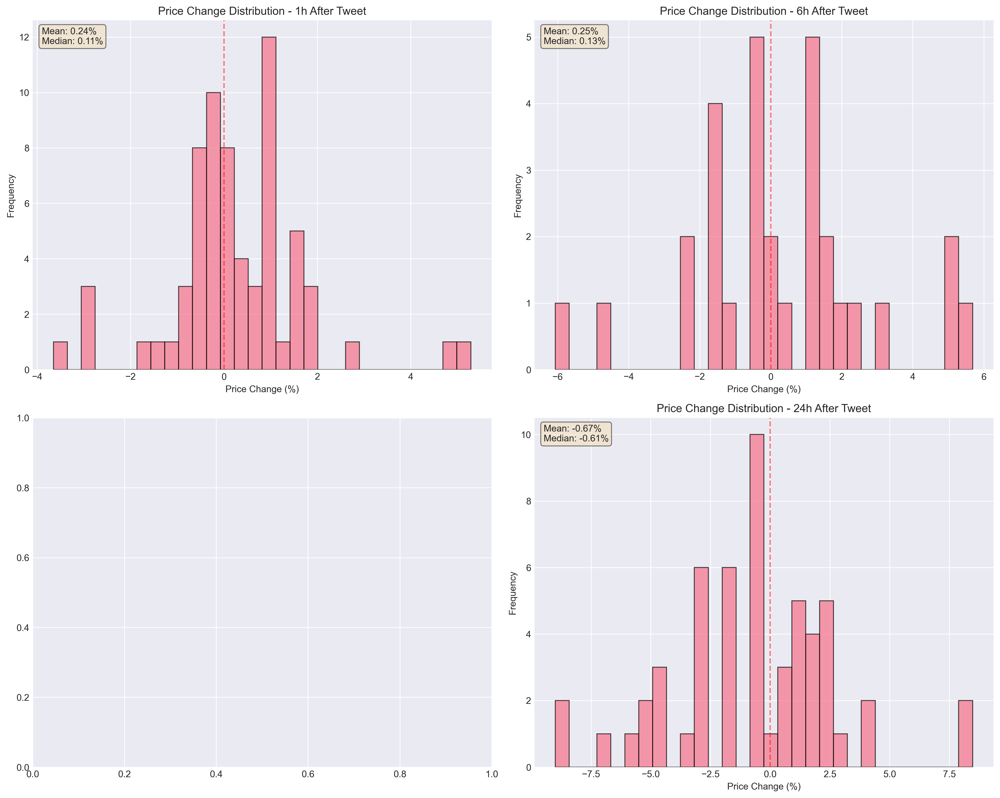
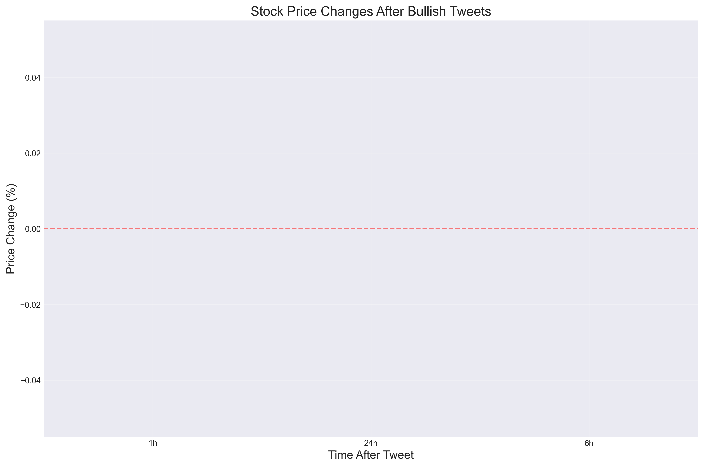
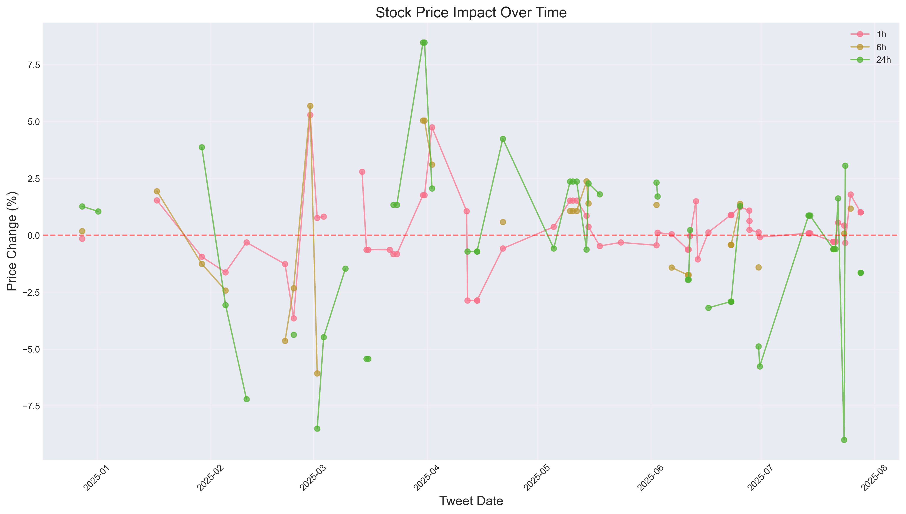

# Tesla Stock Price Impact Analysis from Elon Musk's Bullish Tweets

**Analysis Date**: 2025-07-30 23:26:54

**Period Analyzed**: Past 12 months

**Total Bullish Tweets Analyzed**: 69

## Executive Summary

### Key Findings

#### 1h After Tweet
- **Mean Price Change**: +0.24%
- **Median Price Change**: +0.11%
- **Standard Deviation**: 1.45%
- **Positive Outcomes**: 55.1%

#### 6h After Tweet
- **Mean Price Change**: +0.25%
- **Median Price Change**: +0.13%
- **Standard Deviation**: 2.58%
- **Positive Outcomes**: 23.2%

#### 24h After Tweet
- **Mean Price Change**: -0.67%
- **Median Price Change**: -0.61%
- **Standard Deviation**: 3.49%
- **Positive Outcomes**: 33.3%

### Notable Outcomes

#### 1h Interval
**Best Performance**: +5.29%
- Tweet: "@WholeMarsBlog The long-term outcome for Tesla is very high..."
- Date: 2025-02-28

**Worst Performance**: -3.65%
- Tweet: "Tesla self-driving feels like magic..."
- Date: 2025-02-23

#### 6h Interval
**Best Performance**: +5.69%
- Tweet: "@WholeMarsBlog The long-term outcome for Tesla is very high..."
- Date: 2025-02-28

**Worst Performance**: -6.07%
- Tweet: "It will require outstanding execution, but I think more like 1000% gain for Tesla in 5 years is poss..."
- Date: 2025-03-02

#### 24h Interval
**Best Performance**: +8.47%
- Tweet: "@Gfilche @Tesla A crazy amount of execution is needed to get there, but I do see a path to world’s b..."
- Date: 2025-03-31

**Worst Performance**: -9.00%
- Tweet: "Tesla Autopilot saves lives..."
- Date: 2025-07-23

## Statistical Analysis

### Correlation Matrix

| Interval | Mean | Median | Std Dev | % Positive | Max | Min |
|----------|------|--------|---------|------------|-----|-----|
| 1h | +0.24% | +0.11% | 1.45% | 55.1% | +5.29% | -3.65% |
| 6h | +0.25% | +0.13% | 2.58% | 23.2% | +5.69% | -6.07% |
| 24h | -0.67% | -0.61% | 3.49% | 33.3% | +8.47% | -9.00% |

## Methodology

1. **Data Collection**: Tweets fetched using Apify Twitter Scraper API
2. **Sentiment Analysis**: LLM-based classification (bullish/bearish/neutral)
3. **Stock Data**: Minute-level data from Alpaca Markets API (IEX feed)
4. **Time Intervals**: Price changes measured at 1, 6, 12, and 24 hours post-tweet
5. **Market Hours**: Analysis limited to regular trading hours (9:30 AM - 4:00 PM ET)

## Visualizations

## Sample Bullish Tweets Analyzed

### 2025-07-28
**Tweet**: "Samsung agreed to allow Tesla to assist in maximizing manufacturing efficiency.

This is a critical point, as I will walk the line personally to accelerate the pace of progress. And the fab is conveni..."
- **Confidence**: 0.90
- **24h Price Change**: -1.65%

### 2025-07-28
**Tweet**: "Samsung’s giant new Texas fab will be dedicated to making Tesla’s next-generation AI6 chip. The strategic importance of this is hard to overstate.

Samsung currently makes AI4. 

TSMC will make AI5, w..."
- **Confidence**: 0.90
- **24h Price Change**: -1.65%

### 2025-07-23
**Tweet**: "Tesla Autopilot saves lives..."
- **Confidence**: 0.90
- **24h Price Change**: -9.00%

### 2025-07-21
**Tweet**: "If our retro-futuristic diner turns out well, which I think it will, @Tesla will establish these in major cities around the world, as well as at Supercharger sites on long distance routes. 

An island..."
- **Confidence**: 0.90
- **24h Price Change**: -0.61%

### 2025-07-20
**Tweet**: "Your Tesla self-driving capability will see a step change improvement as we integrate upgrades for the Austin robotaxi build into the general production release..."
- **Confidence**: 0.90
- **24h Price Change**: -0.61%

## Disclaimer

This analysis is for educational purposes only and should not be considered as financial advice. Past performance does not guarantee future results. Multiple factors influence stock prices beyond social media posts.
